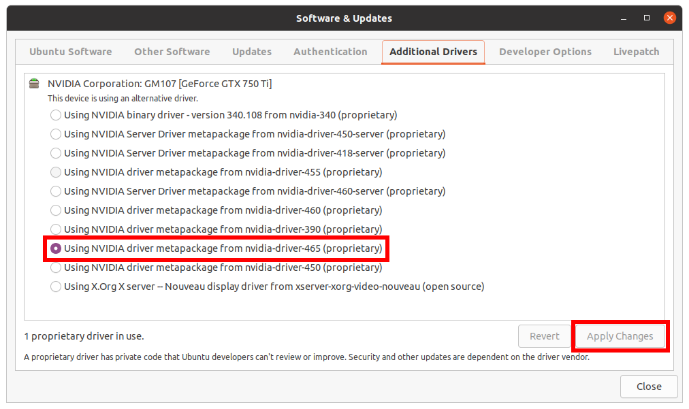

# Cuda Installation guide on ubuntu

Works for **Ubuntu 20.04**

## Step 1: Clear nividia packages and dependencies

Remove everything related to NVIDIA in order to have a fresh install.
Warning: this step will uninstall everything related to NVIDIA! You will lose the older version(s) of CUDA and the NVIDIA drivers.

```
$ sudo apt purge '^nvidia-.*'
$ sudo apt autoremove
$ sudo apt update
$ sudo apt upgrade
```

Finally, remove from the apt source any nvidia related repositories.
``$ sudo apt edit-sources``


## Step 2: Install the NVIDIA driver

Go in the ``Software & Updates`` applications. Then, go in the section ``Additional drivers``.

Select the latest (with the highest number) NVIDIA driver starting with NVIDIA driver metapackage. For example, select ``Using NVIDIA driver metapackage from nividia-driver-465 (proprietary)`` (from the screenshot). It is important to select the latest driver to be able to install the latest cuda version.

Once selected, click ``Apply changes``. It will download all the necessary packages. Wait until the process ends.



Finally, reboot your machine.

## Step 3: Install CUDA

The official installation guide can be found [here](https://developer.nvidia.com/cuda-downloads?target_os=Linux&target_arch=x86_64&=Ubuntu&target_version=20.04&target_type=deb_network).

The installation will go through the network. However, you can use another installation type (see the link above).

Setup the nividia repository:
```
$ wget https://developer.download.nvidia.com/compute/cuda/repos/ubuntu2004/x86_64/cuda-ubuntu2004.pin
$ sudo mv cuda-ubuntu2004.pin /etc/apt/preferences.d/cuda-repository-pin-600
$ sudo apt-key adv --fetch-keys https://developer.download.nvidia.com/compute/cuda/repos/ubuntu2004/x86_64/7fa2af80.pub
$ sudo add-apt-repository "deb https://developer.download.nvidia.com/compute/cuda/repos/ubuntu2004/x86_64/ /"
$ sudo apt-get update
```

Install cuda:
* to install the latest cuda: ``$ sudo apt-get -y install cuda``
* to install a specific version of cuda: ``$ sudo apt-get -y install cuda-{version}``. For instance, to install CUDA 11.3: ``$ sudo apt-get -y install cuda-11-3``

## Setup your environment variables

Add the following lines in your bashrc.

```
export PATH=$PATH:/usr/local/cuda-{version}/bin
export LD_LIBRARY_PATH=$LD_LIBRARY_PATH:/usr/local/cuda-{version}/lib64
```
in which ``{version}`` refers to the version of cuda you just installed.

For instance for CUDA 11.3:
```
export PATH=$PATH:/usr/local/cuda-11.3/bin
export LD_LIBRARY_PATH=$LD_LIBRARY_PATH:/usr/local/cuda-11.3/lib64
```

You can check the installation and the version of cuda by running nvcc.

```$ nvcc --version```

If it shows the version, it means the installation was successful.

## Test

### Handmade hello world
You can find a code sample of a kernel call in the file ``main.cu``. Then, compile it with nvcc.

```
$ nvcc -arch={gpu_arch} main.cu
```

**Warning**: you must specify the gpu architecture.
* [Find your gpu architecture](https://en.wikipedia.org/wiki/CUDA#GPUs_supported)
* [List of the gpu architectures](https://docs.nvidia.com/cuda/cuda-compiler-driver-nvcc/index.html#virtual-architecture-feature-list). Find the argument for nvcc.

For instance, for a GeForce GTX 750 Ti which has the Maxwell gpu architecture, ``-arch=compute_50`` must be specified.

Finally, run the program.

```
$ ./a.out
```
You should see 

```
Hello from the host.
Hello from the device.
Success!
```

### More cuda samples
Many more samples can be found [here](#https://github.com/NVIDIA/cuda-samples). A useful one is ``deviceQuery``.
